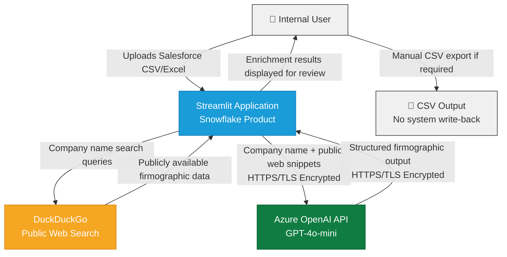

# Architecture & Data Flow Diagram

## Notes
- All communication with Azure OpenAI is encrypted in transit via HTTPS/TLS
- The API key is stored as a secured environment variable
- No data is written back to any internal system
- DuckDuckGo receives company names only as search queries
- No PII or sensitive data is transmitted at any point
